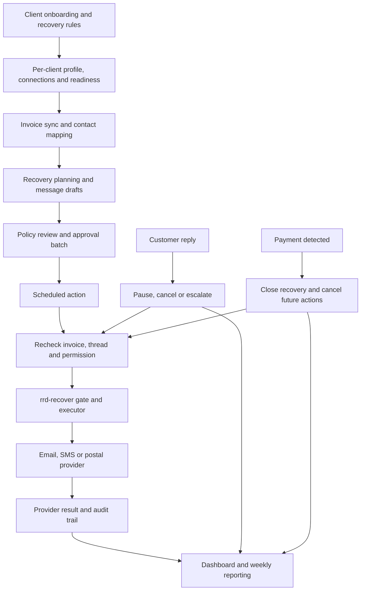

# Revenue Recovery Desk

**An approval-gated agent system for following up overdue business invoices.**

I built Revenue Recovery Desk to bring invoice data, customer context, recovery rules and follow-up into one workflow. It helps a business identify outstanding balances, prepare messages in its own voice, review the proposed outreach, and track what happens after contact. Replies, payments and disputes feed back into the process so the system can stop chasing or hand the case to a person.

The project includes a client portal, an operator control plane, per-client Hermes profiles, OAuth and credential-vault tooling, recovery planning, email/SMS/postal adapters, scheduled jobs and audit records. Some source files and documentation use **RRD** as shorthand and **FlowAudit** as the service brand.

The main engineering decision is to keep language generation separate from permission to act. An agent can suggest a next step or draft a message. The [`rrd-recover` executor](rrd-recover.mjs) checks the client's policy, approvals, allowed tools and usage limits before dispatch.

## Start here

| What you want to understand | Where to look |
| --- | --- |
| The complete recovery workflow | [`src/lib/recovery/pipeline.mjs`](src/lib/recovery/pipeline.mjs) |
| How outbound actions are gated | [`rrd-recover.mjs`](rrd-recover.mjs) and [`rrd-guardrails.mjs`](rrd-guardrails.mjs) |
| A runnable, offline example | [`src/lib/jobs/automation-sandbox.mjs`](src/lib/jobs/automation-sandbox.mjs) |
| The per-client collection loop | [`rrd-collect.mjs`](rrd-collect.mjs) |
| The client dashboard and server routes | [`revenue-recovery-web/`](revenue-recovery-web/) |
| Agent roles and scheduled workflows | [`agents/`](agents/) |
| Architecture and remaining product work | [`docs/ARCHITECTURE.md`](docs/ARCHITECTURE.md) and [`docs/COMPLETION_BRIEF.md`](docs/COMPLETION_BRIEF.md) |

## What it does

- **Client onboarding and provisioning:** records the client's systems, recovery rules, tone, channels, approval requirements and escalation preferences. Provisioning prepares a client-specific Hermes profile, manifest, policy and readiness checklist.
- **Integration setup:** provides OAuth connect flows and secure API-key deposit tooling. Connection status and field mapping are checked separately: having a token does not prove that invoice balances, contacts or payment status are correctly mapped.
- **Recovery planning:** normalises invoice records, creates recovery threads, selects follow-up stages and produces proposed actions with deterministic deduplication keys.
- **Drafting and review:** prepares messages from invoice facts and the client's voice. Deterministic templates provide a default; agent roles and drafter hooks support language assistance and risk review.
- **Approval and dispatch:** groups proposed actions for review, records approval, schedules work and rechecks the invoice and thread immediately before invoking the gated executor.
- **Reply and payment handling:** classifies replies, cancels future actions, records payment reconciliation and creates escalations for cases needing human attention.
- **Client and operator visibility:** exposes readiness, approvals, account state, recovered amounts, outstanding balances, blocked cases, job runs and reporting projections.
- **Offboarding:** includes access-revocation, credential-cleanup and client-retention workflows.

For example, an overdue invoice can become a friendly reminder awaiting approval. If the customer replies with a dispute before dispatch, the scheduled action is blocked or cancelled and the case is escalated. If a payment arrives, later reminders are cancelled and the recovered amount appears in reporting.

## How the system works



### Agent roles

Hermes is the manager and orchestrator. The prompt files describe specialist roles such as recovery planning, message drafting, reply triage, compliance review, escalation and client reporting. They are background workflow roles; their presence does not mean every role runs as a separate conversational agent.

Deterministic modules own state transitions, provider calls, readiness checks, approvals, dispatch and payment reconciliation. LLM assistance is used where language or judgement helps. Its output becomes a draft, classification, summary or review flag rather than unrestricted authority to contact a customer.

See the [workflow manifest](agents/workflows/cron-role-manifest.json) for role assignments and intended schedules.

### Recovery controls

The outbound boundary is `rrd-recover`. Recovery workflows must call this executor rather than send directly through a provider adapter.

Checks cover client approval, authorised channels and tools, contact restrictions, contact hours, discount/payment-plan limits and usage caps. The workflow also checks for paid invoices, existing replies, disputes, blocked threads and previous actions. Missing configuration or a provider failure is reported as a failure rather than a successful send.

Phone calls are treated as a human escalation channel in the executor. The email, SMS and postal adapters are the automated dispatch channels implemented here.

The [recovery policy](docs/RECOVERY_POLICY.md) explains the stage model and stop conditions. The [security guide](docs/SECURITY.md) describes credential handling, tenant boundaries and audit expectations.

## Try the workflow locally

Use **Node.js 22.16 or newer** and npm. The core modules use Node's built-in APIs; the web-interface tests also use `jsdom`.

```bash
git clone https://github.com/kofiowusuai-lab/revenue-recovery-desk.git
cd revenue-recovery-desk
npm install
```

Run the self-contained automation example:

```bash
node src/lib/jobs/automation-sandbox.mjs --approval-to reviewer@example.test
```

This example runs entirely in memory with a synthetic £125 invoice. It demonstrates:

1. Invoice normalisation and recovery-action creation.
2. Approval-batch creation and simulated approval.
3. Dry-run dispatch through an injected executor stub.
4. Payment reconciliation and cancellation of future actions.
5. Dashboard and weekly-report projections.

The output includes `ok: true`, an approved batch, `dispatch.dryRun: true`, one reconciled payment and `dashboard.recoveredCents: 12500`. No account credentials, database, Hermes installation or provider subscriptions are required. Nothing is sent and no external APIs are called. Approval and payment are synthetic inputs; this demo demonstrates the orchestration, while the executor's policy enforcement is tested separately.

### Tests

```bash
# Complete test suite
npm test

# Runtime and readiness checks
npm run test:targeted

# Executor, pipeline and offline automation checks
node --test test/rrd-recover.test.mjs test/rrd-automation-recovery-lane-b.test.mjs test/rrd-automation-e2e-sandbox.test.mjs
```

The suite covers guardrails, approval origin, executor behaviour, provider request shapes, OAuth helpers, vault operations, readiness, state handling, cron authentication, job locks, reporting, web-route security and client interfaces. Provider responses and runtime dependencies are injected or mocked in tests; passing tests do not replace live integration verification.

## Repository layout

```text
revenue-recovery-desk/
├── rrd-*.mjs                  # Operator tools, client profiles and recovery modules
├── rrd-*                      # CLI wrappers and runtime entry points
├── agents/
│   ├── prompts/               # Manager and specialist workflow role definitions
│   └── workflows/             # Cron schedules, execution types and role mapping
├── cron/                      # Invoice, dispatch, reply, payment and reporting jobs
├── src/lib/
│   ├── recovery/              # Canonical pipeline and deterministic action keys
│   ├── jobs/                  # Runtime injection, job locks, audit and offline sandbox
│   ├── db/                    # Validated state store and Supabase adapter
│   ├── client-state/          # Status definitions and dashboard projections
│   ├── reports/               # Weekly recovery reporting
│   ├── notifications/         # Client-success drafts
│   └── security/              # Cron-secret validation
├── revenue-recovery-web/      # HTML/CSS client and operator pages; server API routes
├── supabase/                  # Base SQL schema and additive migrations
├── revenue-recovery-contracts/ # Service, data-processing and recovery-authority templates
├── test/                      # Node test-runner suites
└── docs/                      # Architecture, setup, operations and implementation notes
```

## Integrations

The repository contains connector setup and credential tooling for several provider families. Availability depends on the client configuration, provider app registration, granted scopes, field mapping and the runtime adapter in use.

| Area | Examples in the source |
| --- | --- |
| Accounting and invoices | Stripe, QuickBooks Online, Xero, Sage, FreshBooks, Wave, Zoho Books and FreeAgent |
| CRM and business context | HubSpot, Salesforce, Pipedrive, Zoho CRM, monday.com and Dynamics 365 |
| Email delivery | SendGrid, Postmark, Mailgun and AgentMail |
| SMS | Twilio |
| Physical letters | PostGrid, with letter generation, preview/style tooling and postal approval queues |
| Managed connections | Composio helper and connector configuration |

These are not interchangeable claims of complete end-to-end support. For example, [`rrd-collect.mjs`](rrd-collect.mjs) includes a Stripe overdue-invoice path, while the canonical automation runtime accepts injected invoice/payment/reply providers. Each connector needs its own readiness and mapping verification before recovery begins.

Read the [connector strategy](docs/integration-connector-strategy.md), [OAuth setup guide](docs/oauth-provider-app-setup.md) and [PostGrid billing and opt-out notes](docs/letter-postgrid-billing-and-optout.md) for details.

## State, scheduling and audit

The canonical state model separates clients, settings, integrations, invoices, recovery threads, actions, approvals, replies, payments, reports, agent runs, audit events and job locks. Supabase/Postgres schema and migration files are included, alongside an injected Supabase adapter and testable in-memory stores.

Actions use deterministic keys to avoid drafting the same invoice/stage/channel repeatedly. Scheduled dispatch rechecks current state instead of relying only on the earlier approval. Jobs use locking and run records to track execution and failures. Production deployments must supply persistent state and shared locking appropriate to their runtime; the default in-memory implementations are useful for isolated tests.

The [manifest](agents/workflows/cron-role-manifest.json) defines five-minute dispatch/reply/health jobs, fifteen-minute readiness/approval checks, hourly invoice/payment jobs, daily planning/escalation review and weekly reports. Including these files does not install a scheduler. The operator deployment must wire the jobs, credentials and provider implementations.

## Running the managed system

The offline example is portable. The managed deployment also needs:

- A configured Supabase project, the relevant schema/migrations and server-side credentials.
- Client-specific Hermes profiles, policies, manifests and approved data mappings.
- Registered OAuth apps or scoped API credentials for the selected providers.
- Sending accounts and approved sender identities for the selected contact channels.
- A scheduler, persistent job/state storage and an operator deployment for the web/API layer.
- The selected agent/runtime installation. Orgo helpers are included, but some runtime tooling is maintained outside this repository.

[`.env.example`](.env.example) contains starter placeholders, not a complete deployment configuration. Provider-specific setup guides document the additional variables. Several CLI wrappers retain paths from the original operator environment, including `/Users/AIAgenterminal`; modules that support `RRD_OPERATOR_HOME` or `HERMES_PROFILES_DIR` can be redirected, while other wrappers need adapting before use on another machine. There is no single `npm start` command that launches the entire managed service.

The web layer uses static HTML/CSS/JavaScript and server API routes with a Vercel configuration. [Deployment notes](docs/web-routes-and-deploy.md) explain the separate web app and branded-route arrangement. Deploying the portal alone does not start the background recovery jobs.

Secrets belong in the credential vault or deployment secret manager. Keep real `.env` files, OAuth stores, vault private keys, client records and runtime logs out of Git. The normal state store rejects secret-looking values; credential-handling helpers have their own storage boundaries.

## Further reading

- [Architecture](docs/ARCHITECTURE.md): execution model, state flow and extension points.
- [Operations](docs/OPERATIONS.md): job cadence, daily checks and incident handling.
- [Client experience](docs/CLIENT_EXPERIENCE.md): onboarding, approvals and integration settings.
- [Recovery policy](docs/RECOVERY_POLICY.md): stages, stop conditions and escalation.
- [Security](docs/SECURITY.md): credentials, contact controls and audit requirements.
- [Completion brief](docs/COMPLETION_BRIEF.md): product roadmap and remaining work. Treat its requested features as roadmap items, not proof that every item is already deployed.

Built by [kofiowusuai-lab](https://github.com/kofiowusuai-lab) · [Kedolabs](https://kedolabs.com/).
